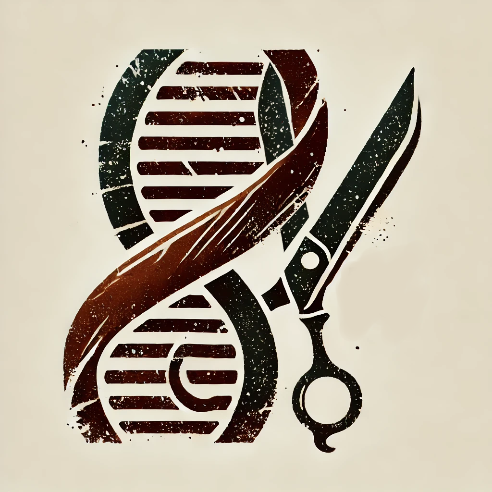

# WELCOME TO DELILAH's CUT

## Installation

As of now, Delilah's Cut is available for all Windows machines but has a requirement of Python being installed on the machine. To install python, go to python.org/downloads. 

To use the recommended .exe version, simply copy the "Delilahs's Cut siRNA Design" folder to wherever you would like on your machine. Within that folder is the .exe, and all you need to do is double-click to start the program. The folders adjacent to the .exe are used for file input and output.

A video tutorial covering installation as well as usage can be found at this link: https://youtu.be/1NEDxi6y2q4

## Custom Packaging

If you wish to make any edits to the program files yourself, such as adding additional functions to analyze siRNA (Maybe you want to see a G in position 6 or anything like that). You can do so and then repackage. 
To do this:
1. Make any necessary edits to the code
2. Activate the provided virtual environment (venv) (command: venv\Scripts\Activate)
3. Navigate to the "Main_Files" directory in terminal
4. Run "pyinstaller main.spec"
5. Take the Delilah's_Cut.exe file and place it in the Delilah's Cut siRNA Design folder
6. Run as you wish

Packaging can be finicky due to a conflict between PyQt6 and ViennaRNA. Good Luck!

## What is Delilah's Cut?

There are many siRNA design tools out there, and I'd recommend trying them out. However, you may be disappointed with some of the features of many of them. Many are not very customizable, can act a bit like a black box, and don't give a detailed rationale for their selection. 

Delilah's cut seeks to put more power in the hands of the researcher and allow more custom siRNA design. With this program you can edit every exclusion and scoring parameter, as well as generate settings and preferences to use over and over again. As an siRNA user, I often ran into problems with siRNAs from companies sometimes violating basic siRNA design principles. Delilah's cut will tell you the exact limitations of every siRNA it generates, and never leave you in the dark. 
Still this tool has many limitations that need to be acknowleged. In this current version, Auto-Blast Search is unavailable, meaning off-target affect screening should be done manually. The default values are also yet to be optimized experimentally or based on an existing database, due to their poor maintenance and difficulty accessing. 

## Usage and Info

Detailed Usage and Info can be found in the corresponding pages within the EXE, or in the Unpacked Delilah's Cut\Main_Files\MarkDownFiles. 

This program is designed to be GUI-based and user-friendly and was created by Jeffrey Hage, who received a Bachelor's in Biochemistry from the University of Colorado Boulder. He can be contacted at Jeffrey.Hage@Colorado.edu. If you are interested in becoming a developer on this project, feel free to contact.

## Future Directions:

Future Implimentations are:
1. Removing python requirement
2. DMG Packaging for Mac users
3. Optimizing default settings with an ML model upon the availability of a database
4. Addition of Blast search (Currently removed because too computationally intensive)
5. Additional functions for siRNA analysis upon request.
6. Bug fixing upon request.
